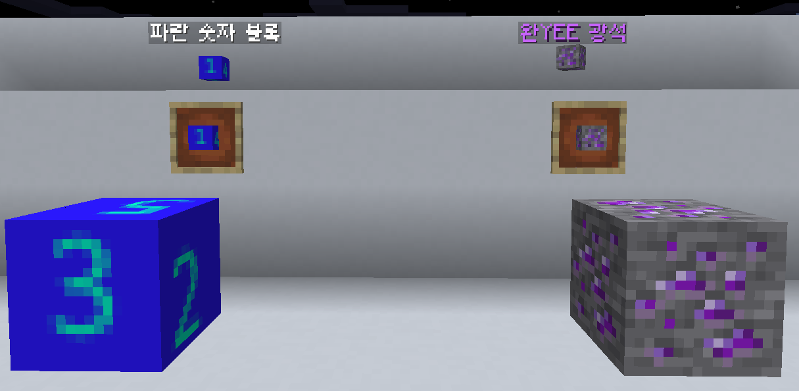

# Cucumbery
[Paper-API](https://papermc.io/) 기반 Minecraft 서버 플러그인  
[홈페이지](https://cucumbery.com)  

# 주요 기능
- 커스텀 설명: 유용한 아이템 성능과 정보를 설명에 표시
- 커스텀 조합: 최대 15종류의 재료와 제작 조건을 통한 아이템 제작
- 커스텀 효과: 마인크래프트에 없는 다양한 상태 효과 제공 및 확장 가능 API 제공
- 커스텀 채광: 마인크래프트 자체 블록 파괴 시스템을 오버라이딩하여 블록 파괴 속도 및 도구와 블록의 등급 제어
- 커스텀 블록: 일반적으로 저장되지 않는 데이터(인챈트, 이름)이 있는 블록 설치 후 파괴해도 데이터 유지
- 커스텀 아이템: 아이템 우클릭/좌클릭/버리기 등의 이벤트 발생 시 명령어를 실행하는 기능
- 커스텀 데스 메시지: 플레이어 또는 다른 개체가 사망할 때 나타나는 데스 메시지 사용자 지정 기능
- 타 플러그인 연동: [Vault](https://www.spigotmc.org/resources/vault.34315/),
[NoteBlockAPI](https://www.spigotmc.org/resources/noteblockapi.19287/),
[QuickShop](https://www.spigotmc.org/resources/quickshop-reremake-1-20-2-ready-multi-currency.62575/),
[ProtocolLib](https://www.spigotmc.org/resources/protocollib.1997/),
[WorldEdit](https://github.com/EngineHub/WorldEdit/) 등 연동 및 추가 기능 제공
# 이미지
## 커스텀 설명

## 커스텀 조합

## 커스텀 효과

## 커스텀 채광

채굴 가능한 반복형 명령 블록
## 커스텀 블록

엔티티 기반 리소스팩을 요구하지 않는 커스텀 텍스처 블록
## 커스텀 아이템

## 커스텀 데스 메시지

## 타 플러그인 연동
### NoteBlockAPI

### PlaceHolderAPI

### ProtocolLib

바닥에 떨어져 있는 아이템 이름을 packet으로 전송

개체에게 피해를 입힐 때 준 피해량이 화면에 표시됨
### WorldEdit

월드에딧 포지션 지정 입자 표시